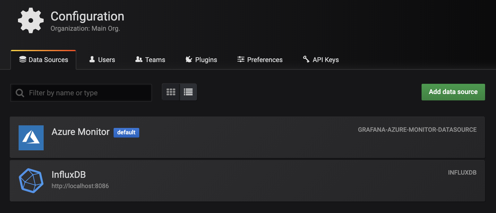
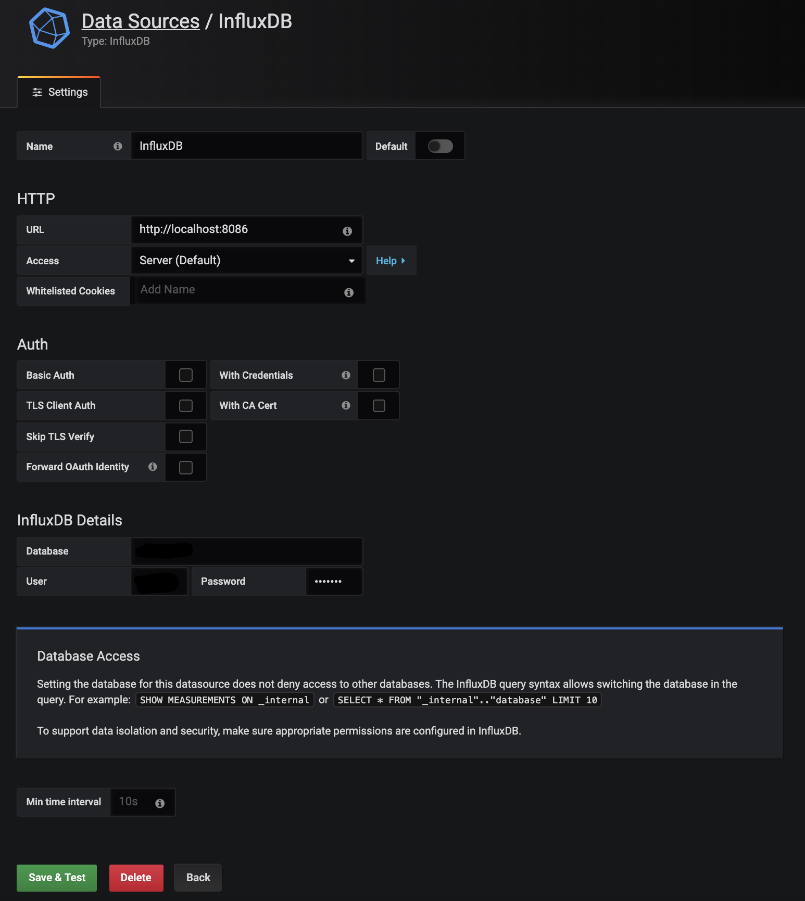
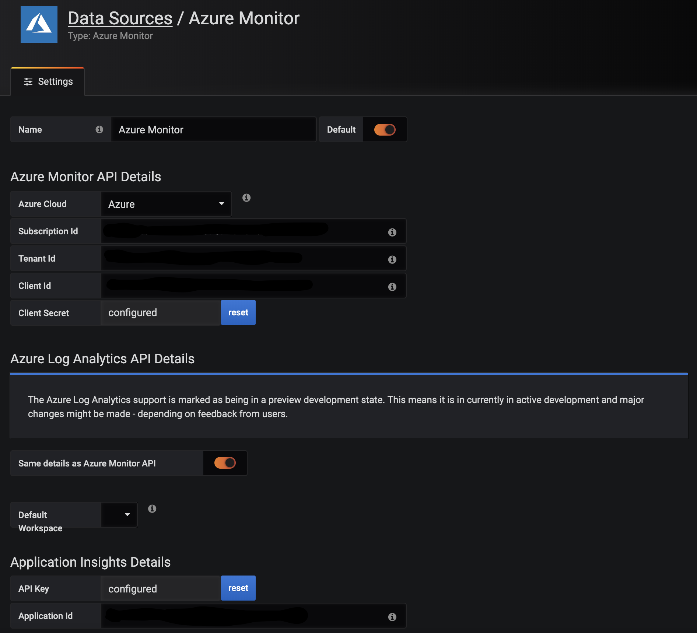
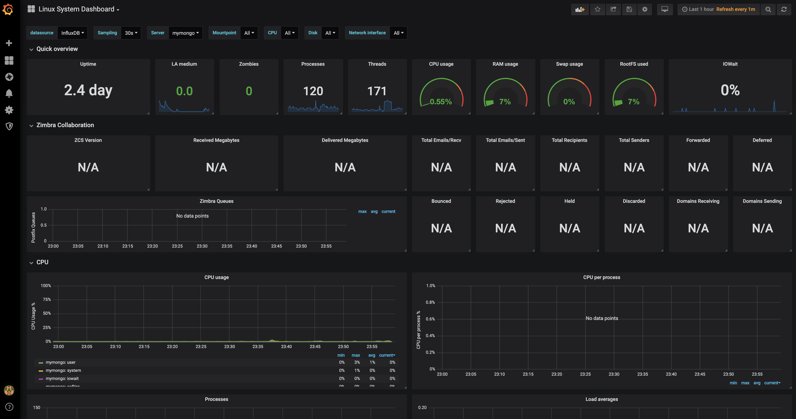

`telegraf` `influxdb` `grafana` `azure` `aws` `gcp` `cloud`

# Terraform and Ansible script for automated setup is under "src". 

# Create new VM for TIG stack by using terraform
  * OS version : CentOS 7.5
  * setup invironment
    ```
      sudo sh setup.sh

    ```
   * create monitoring VM where tig stack would be installed 
      * azure cli installation
        If you want to use any different method for authenticating to Azure, check on [here](https://www.terraform.io/docs/providers/azurerm/auth/azure_cli.html).
        
        check how-to on [here](https://docs.microsoft.com/en-us/cli/azure/install-azure-cli?view=azure-cli-latest)

        > *sample for linux*   
        > sudo rpm --import https://packages.microsoft.com/keys/microsoft.asc
        > sudo sh -c 'echo -e "[azure-cli]\nname=Azure CLI\nbaseurl=https://packages.microsoft.com/yumrepos/azure-cli\nenabled=1\ngpgcheck=1\ngpgkey=https://packages.microsoft.com/keys/microsoft.asc" > /etc/yum.repos.d/azure-cli.repo'
        > sudo yum install azure-cli
        
*       azure configuration
        > $ az login  
        > $ az account list   
        > $ az account set --subscription="${subscriptionid}>" 
        
        Create service principal to run terraform. default RBAC role for the service principal is Contributor.  
        > Note the output : appId, password, sp_name, tenant  
        > $ az ad sp create-for-rbac --role="Contributor" --scopes="/subscriptions/${subscriptionid}"  

        Set environment variables
        > $ export ARM_SUBSCRIPTION_ID=  
        > $ export ARM_CLIENT_ID=  
        > $ export ARM_CLIENT_SECRET=  
        > $ export ARM_TENANT_ID=  


# Telegraf, InfluxDB & Grafana

### Overview
  * Telegraf
    * the plugin-driven server agent for collecting & reporting metrics.
    * You can refer the details on the [Telegraf Github](https://github.com/influxdata/telegraf)

  * InfluxDB
    * the time series database storing the data its receiving from Telegraf agents.

  * Grafana
    * the visualization tool being used to visualize the data stored in the InfluxDB time series database.


### Installation
  * Download the Telegraf & Influxdb rpm packages [here](https://portal.influxdata.com/downloads/).
  * Download the Grafana rpm packages [here](https://grafana.com/grafana/download).


### Config
  * telegraf configuration  
    /etc/telegraf/telegraf.conf

    ```
      # Config for influxdb output plugin
      [[outputs.influxdb]]
      urls = ["http://<the IP of your InfluxDB server>:8086"]
      database = "telegraf"
      retention_policy = ""
      write_consistency = "any"
      timeout = "5s"
    ```
  * influxDB configuration
  

### Commands for services 
Sample commands on CentOS
  * status
    ```
      sudo systemctl status influxdb
      sudo systemctl status telegraf
      sudo systemctl status grafana-server
    ```

  * run
    ```
      sudo systemctl daemon-reload
      sudo systemctl enable influxdb
      sudo systemctl start influxdb
      sudo systemctl enable telegraf
      sudo systemctl start telegraf
      sudo systemctl enable grafana-server
      sudo systemctl start grafana-server
    ```

### Access
  Grafana : http://<the_grafana_server_ip_address>:3000
  - initial login with admin/admin


### Setup Grafana Dashboard
* Set up datasources

  *Configuration > Data Sources*
  

  1. Data Source : InfluxDB  
    [How to use InfluxDB in Grafana](https://grafana.com/docs/features/datasources/influxdb/)
    

  2. Data Source : Azure Monitor  
    [How to use Azure monitor in Grafana](https://grafana.com/docs/features/datasources/azuremonitor/)
    

    * Scheduled Event  
      [scheduled event for Linux VMs](https://docs.microsoft.com/en-us/azure/virtual-machines/linux/scheduled-events)  
      [Python script](scripts/scheduled_event_for_linux.py)

      [scheduled event for Wiond3ows VMs](https://docs.microsoft.com/en-us/azure/virtual-machines/windows/scheduled-events)  
      [PowerShell sample](scripts/scheduled_event_for_windows.ps)

  3. Data Source : AWS Cloudwatch (#TODO)

  4. Data Source : GCP Stackdriver (#TODO)


* Create Dashboard  
  * Import template id
  [*linux host dashboard for grafana*](https://grafana.com/dashboards/2846)
  

  * Create your own

